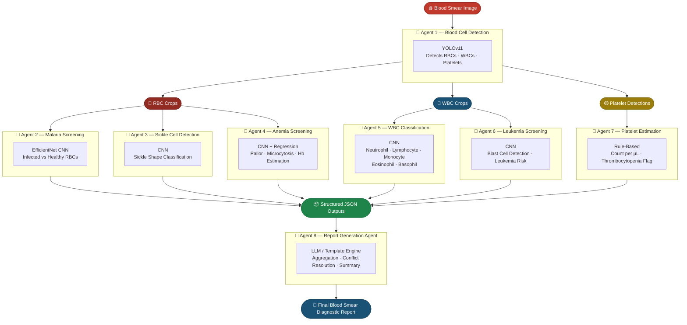
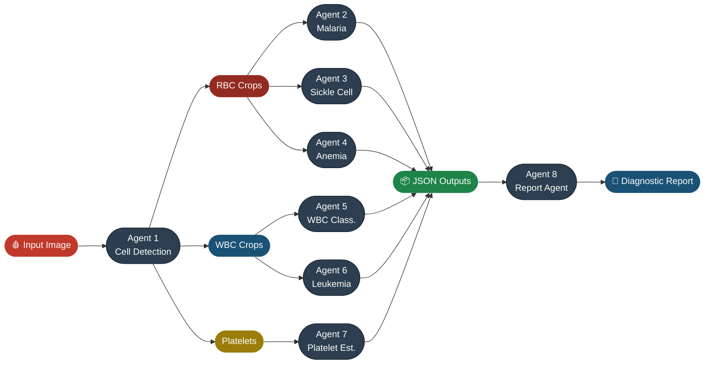

<div align="center">


<br/>

**Collaborative AI Vision Agents for Automated Blood Cell Detection, Disease Screening, and Clinical Report Generation.**

<br/>

<!-- Core Stack -->
[](https://python.org)
[](https://fastapi.tiangolo.com)
[](https://react.dev)
[](https://pytorch.org)
[](https://ultralytics.com)
[](https://opencv.org)
[](https://mongodb.com)
[](https://docker.com)

<br/>

<!-- Domain Tags -->
[](.)
[](.)
[](.)
[](.)
[](./LICENSE)
[](.)

<br/><br/>

[**Explore the Docs**](#-project-overview) · [**View Architecture**](#%EF%B8%8F-multi-agent-system-architecture) · [**Meet the Agents**](#-ai-agents) · [**Quick Start**](#-installation)

</div>

---

## 📋 Table of Contents

| # | Section |
|---|---|
| 1 | [Project Overview](#-project-overview) |
| 2 | [Features](#-features) |
| 3 | [Problem Statement](#-problem-statement) |
| 4 | [Objectives](#-objectives) |
| 5 | [Technology Domain](#-technology-domain) |
| 6 | [Multi-Agent System Architecture](#%EF%B8%8F-multi-agent-system-architecture) |
| 7 | [AI Agents](#-ai-agents) |
| 8 | [Multi-Agent Workflow](#-multi-agent-workflow) |
| 9 | [Technology Stack](#%EF%B8%8F-technology-stack) |
| 10 | [Project Structure](#-project-structure) |
| 11 | [Installation](#-installation) |
| 12 | [Screenshots](#-screenshots) |
| 13 | [Future Enhancements](#-future-enhancements) |
| 14 | [Team Structure](#-team-structure) |
| 15 | [License](#-license) |

---

## 🔬 Project Overview

Peripheral blood smear (PBS) analysis is one of the most critical diagnostic procedures in clinical hematology. A single stained blood smear can expose a wide spectrum of conditions — from **malaria and anemia** to **leukemia and sickle cell disease** — providing clinicians with a direct window into a patient's hematological health.

Despite its diagnostic power, traditional PBS examination remains a deeply manual, resource-intensive process. In high-volume hospitals and especially in **rural and low-resource healthcare settings**, the bottlenecks are severe:

- 🔴 **Expert dependency** — accurate analysis requires a trained hematologist or pathologist
- 🔴 **Throughput limitations** — a single thorough examination takes 30–60 minutes per sample
- 🔴 **Infrastructure costs** — specialized microscopes, reagents, and laboratory setups are expensive
- 🔴 **Geographic inaccessibility** — expert hematology services are absent in most rural clinics worldwide
- 🔴 **Diagnostic delays** — in time-critical conditions like malaria or leukemia, delays cost lives

**HemaScope AI** is built to eliminate these barriers. Rather than replacing the physician, it acts as an intelligent first-line screening system — a team of specialized AI agents that collaborates to analyze a blood smear image end-to-end, producing a structured diagnostic report in seconds.

The system follows a **Multi-Agent AI architecture** where each agent is an independent specialist:

> 🧠 *One agent detects cells. Others screen for diseases. A final agent synthesizes everything into a clinical report — mirroring how a team of specialist physicians approaches a complex case.*

> 🏆 HemaScope AI is designed for **healthcare diagnostics**, **medical AI research**, and **AI agent system competitions** — demonstrating the real-world power of collaborative, modular agentic architectures in medical image analysis.

---

## ✨ Features

<table>
<tr>
<td width="50%">

**🔵 Blood Cell Detection**
Detects and localizes RBCs, WBCs, and Platelets using YOLOv11 with bounding box precision.

**🦟 Malaria Screening**
Classifies individual RBC crops as infected or healthy using EfficientNet-based CNN.

**🔴 Sickle Cell Detection**
Identifies sickle-shaped (crescent) red blood cells from morphological features.

**💉 Anemia Screening**
Estimates hemoglobin-related features and detects anemic RBC morphology patterns.

**🧫 WBC Classification**
Classifies white blood cells into five clinical subtypes with differential count output.

</td>
<td width="50%">

**🧬 Leukemia Screening**
Detects blast cells and leukemia indicators from WBC crop analysis.

**🩸 Platelet Estimation**
Estimates platelet count per µL and flags thrombocytopenia or thrombocytosis.

**📄 Automated Report Generation**
Aggregates all agent outputs into a unified, structured clinical diagnostic report.

**🤝 Collaborative Multi-Agent Workflow**
Independent agents run in parallel and feed results into a central report agent.

**📦 Modular & Scalable Architecture**
Each agent can be independently trained, updated, replaced, or extended.

</td>
</tr>
</table>

---

## ❗ Problem Statement

Manual microscopic examination of peripheral blood smears remains the gold standard for diagnosing a wide range of hematological conditions. However, this workflow carries significant systemic limitations that make it unsuitable as a scalable, accessible diagnostic solution:

| Challenge | Impact |
|---|---|
| **Human Expertise Dependency** | Requires trained hematologists — a scarce resource globally |
| **Time-Intensive Process** | 30–60 minutes per sample creates critical bottlenecks |
| **High Infrastructure Cost** | Specialized equipment and reagents are expensive |
| **Geographic Inaccessibility** | Rural and remote clinics lack laboratory infrastructure |
| **Diagnostic Delays** | Delayed results in malaria, leukemia, and sickle cell cases lead to preventable deaths |
| **Subjectivity & Variability** | Results vary between examiners, reducing diagnostic consistency |

In low- and middle-income countries — where malaria, sickle cell anemia, and iron-deficiency anemia are most prevalent — access to expert hematology services is critically limited. The consequences are measurable: **delayed diagnoses, preventable deaths, and overwhelmed healthcare systems**.

**HemaScope AI** directly addresses this gap by deploying a collaborative system of specialized AI agents that automates the entire blood smear analysis pipeline — delivering fast, consistent, and accessible diagnostics at scale, without requiring a human expert in the loop.

---

## 🎯 Objectives

- [x] Detect and localize **Red Blood Cells (RBCs)** in blood smear images
- [x] Detect and localize **White Blood Cells (WBCs)** in blood smear images
- [x] Detect and localize **Platelets** in blood smear images
- [x] Screen for **Malaria** from RBC morphology
- [x] Screen for **Sickle Cell Disease** from RBC shape analysis
- [x] Screen for **Anemia** from RBC pallor and morphological features
- [x] Classify **WBC subtypes** — Neutrophil, Lymphocyte, Monocyte, Eosinophil, Basophil
- [x] Detect **Leukemia indicators** and blast cells from WBC crops
- [x] Estimate **Platelet count per µL** and flag abnormal ranges
- [x] Generate a **structured AI-assisted clinical diagnostic report**
- [x] Reduce diagnosis time from **hours to seconds**
- [x] Demonstrate **collaborative Multi-Agent AI** in a real-world medical context
- [x] Improve **accessibility to hematology diagnostics** in resource-limited settings

---

## 🧠 Technology Domain

| Domain | Technologies |
|---|---|
| **Artificial Intelligence** | Multi-Agent Systems, Agentic AI Workflows |
| **Deep Learning** | CNN, EfficientNet, YOLOv11, PyTorch |
| **Machine Learning** | Classification, Regression, Object Detection |
| **Computer Vision** | OpenCV, TorchVision, Image Segmentation |
| **Medical Image Analysis** | Blood Smear Analysis, Hematology Imaging |
| **Backend Engineering** | Python 3.10+, FastAPI, REST API |
| **Frontend Engineering** | React.js, Tailwind CSS |
| **Database** | MongoDB |
| **DevOps & Deployment** | Docker, Docker Compose |

---

## 🏗️ Multi-Agent System Architecture



---

## 🤖 AI Agents

<details open>
<summary><strong>Agent 1 — Blood Cell Detection Agent</strong></summary>

<br/>

| Field | Details |
|---|---|
| **Purpose** | Detect and localize all blood cells in the full smear image |
| **Input** | Full-resolution blood smear image |
| **Output** | Bounding boxes · Class labels (RBC / WBC / Platelet) · Cropped cell images |
| **Technology** | YOLOv11 (Ultralytics) |
| **Datasets** | [TXL-PBC Dataset](https://www.kaggle.com/) · [BCCD Dataset](https://github.com/Shenggan/BCCD_Dataset) |

</details>

<details open>
<summary><strong>Agent 2 — Malaria Screening Agent</strong></summary>

<br/>

| Field | Details |
|---|---|
| **Purpose** | Classify RBC crops as malaria-infected or healthy |
| **Input** | Cropped RBC images from Agent 1 |
| **Output** | Per-cell classification · Infection probability · Smear-level aggregate result |
| **Technology** | EfficientNet / CNN |
| **Datasets** | [NIH Malaria Cell Images](https://www.kaggle.com/iarunava/cell-images-for-detecting-malaria) · [IML Malaria Dataset](https://www.kaggle.com/) |

</details>

<details open>
<summary><strong>Agent 3 — Sickle Cell Detection Agent</strong></summary>

<br/>

| Field | Details |
|---|---|
| **Purpose** | Identify sickle-shaped (crescent) red blood cells |
| **Input** | Cropped RBC images from Agent 1 |
| **Output** | Per-cell shape classification · Sickle cell percentage |
| **Technology** | CNN |
| **Dataset** | [Sickle Cell Disease Dataset — Kaggle](https://www.kaggle.com/) |

</details>

<details open>
<summary><strong>Agent 4 — Anemia Screening Agent</strong></summary>

<br/>

| Field | Details |
|---|---|
| **Purpose** | Detect anemic RBC morphology and estimate hemoglobin-related features |
| **Input** | Cropped RBC images from Agent 1 |
| **Output** | Anemia likelihood score · Morphological features (pallor, microcytosis, hypochromia) |
| **Technology** | CNN + Regression |
| **Dataset** | [AneRBC Dataset](https://www.kaggle.com/) |

</details>

<details open>
<summary><strong>Agent 5 — White Blood Cell Classification Agent</strong></summary>

<br/>

| Field | Details |
|---|---|
| **Purpose** | Classify WBCs into their five major clinical subtypes |
| **Input** | Cropped WBC images from Agent 1 |
| **Output** | WBC subtype label · Differential count (Neutrophil / Lymphocyte / Monocyte / Eosinophil / Basophil) |
| **Technology** | CNN |
| **Dataset** | [Raabin-WBC Dataset](https://raabindata.com/free-data/) |

</details>

<details open>
<summary><strong>Agent 6 — Leukemia Screening Agent</strong></summary>

<br/>

| Field | Details |
|---|---|
| **Purpose** | Detect blast cells and leukemia indicators in WBC crops |
| **Input** | Cropped WBC images from Agent 1 |
| **Output** | Blast cell detection · Leukemia risk classification |
| **Technology** | CNN |
| **Datasets** | [C-NMC Leukemia Dataset](https://wiki.cancerimagingarchive.net/) · [Raabin Leukemia Dataset](https://raabindata.com/) |

</details>

<details open>
<summary><strong>Agent 7 — Platelet Estimation Agent</strong></summary>

<br/>

| Field | Details |
|---|---|
| **Purpose** | Estimate platelet count and flag abnormal ranges |
| **Input** | Platelet detection counts from Agent 1 |
| **Output** | Estimated platelet count per µL · Thrombocytopenia / Thrombocytosis flag |
| **Technology** | Rule-based estimation — no independent model training |
| **Dataset** | Uses Agent 1 detections directly |

</details>

<details open>
<summary><strong>Agent 8 — Report Generation Agent</strong></summary>

<br/>

| Field | Details |
|---|---|
| **Purpose** | Aggregate all agent outputs into a unified structured diagnostic report |
| **Input** | JSON outputs from Agents 1–7 |
| **Output** | Final blood smear diagnostic report (PDF / JSON / HTML) |
| **Technology** | LLM / Jinja2 Template Engine — no model training required |
| **Dataset** | N/A |

</details>

---

## 🔄 Multi-Agent Workflow



**Step-by-step execution:**

```
Step 1 │ 🩸  Blood smear image uploaded via the clinician dashboard
       │
Step 2 │ 🤖  Agent 1 runs YOLOv11 inference on the full image
       │     → Outputs bounding boxes for all RBCs, WBCs, and Platelets
       │     → Crops individual cell images for downstream agents
       │
Step 3 │ 🔴  RBC crops dispatched in parallel to:
       │     → Agent 2  (Malaria Screening)
       │     → Agent 3  (Sickle Cell Detection)
       │     → Agent 4  (Anemia Screening)
       │
Step 4 │ 🔵  WBC crops dispatched in parallel to:
       │     → Agent 5  (WBC Classification)
       │     → Agent 6  (Leukemia Screening)
       │
Step 5 │ 🟡  Platelet detection counts forwarded to:
       │     → Agent 7  (Platelet Estimation)
       │
Step 6 │ 📦  Each agent returns a structured JSON payload:
       │     { agent_id, findings, confidence, cell_counts, flags }
       │
Step 7 │ 🤖  Agent 8 aggregates all JSON outputs
       │     → Resolves conflicts · Computes summary statistics
       │     → Renders human-readable diagnostic report
       │
Step 8 │ 📄  Final Blood Smear Report delivered to the clinician dashboard
```

---

## 🛠️ Technology Stack

| Layer | Technology | Purpose |
|---|---|---|
| **Frontend** | React.js 18, Tailwind CSS | Clinician dashboard & report viewer |
| **Backend** | Python 3.10+, FastAPI | Agent orchestration & REST API |
| **Object Detection** | YOLOv11 (Ultralytics) | Blood cell detection — Agent 1 |
| **Deep Learning** | PyTorch 2.0+, TorchVision | Model training & inference |
| **Image Processing** | OpenCV 4.x | Preprocessing & cell cropping |
| **Classification** | EfficientNet, Custom CNN | Disease screening agents |
| **Report Engine** | Jinja2 / LLM Template Engine | Diagnostic report generation |
| **Database** | MongoDB 7.0+ | Patient records & report storage |
| **Containerization** | Docker, Docker Compose | Deployment & environment isolation |
| **API Protocol** | REST (JSON) | Inter-agent & client communication |

---

## 📁 Project Structure

```
HemaScope/
│
├── agent-1-cell-detection/         # 🔵 YOLOv11 blood cell detection
│   ├── frontend/                   #    Agent UI component
│   └── backend/                    #    Inference API + model weights
│
├── agent-2-malaria/                # 🦟 Malaria screening (EfficientNet)
│   ├── frontend/
│   └── backend/
│
├── agent-3-sickle/                 # 🔴 Sickle cell detection (CNN)
│   ├── frontend/
│   └── backend/
│
├── agent-4-anemia/                 # 💉 Anemia screening (CNN + Regression)
│   ├── frontend/
│   └── backend/
│
├── agent-5-wbc/                    # 🧫 WBC classification (CNN)
│   ├── frontend/
│   └── backend/
│
├── agent-6-leukemia/               # 🧬 Leukemia screening (CNN)
│   ├── frontend/
│   └── backend/
│
├── agent-7-platelet/               # 🩸 Platelet estimation (rule-based)
│   ├── frontend/
│   └── backend/
│
├── report-agent/                   # 📄 Report generation agent
│   ├── frontend/                   #    Report viewer UI
│   └── backend/                    #    Aggregator + LLM template engine
│
├── docs/                           # 📚 Documentation & API specs
├── datasets/                       # 🗂️  Dataset references & configs
├── models/                         # 🧠 Shared model weights
├── assets/                         # 🖼️  Images, diagrams, screenshots
├── requirements.txt                # 🐍 Python dependencies
├── package.json                    # 📦 Node.js dependencies
├── docker-compose.yml              # 🐳 Multi-container orchestration
└── README.md
```

---

## 🚀 Installation

### Prerequisites

> Ensure the following are installed before proceeding.

| Requirement | Version |
|---|---|
| Python | 3.10+ |
| Node.js | 18+ |
| Docker & Docker Compose | Latest |
| MongoDB | 7.0+ (local or Atlas) |

### 1 · Clone the Repository

```bash
git clone https://github.com/<your-username>/HemaScope.git
cd HemaScope
```

### 2 · Backend Setup

```bash
python -m venv venv
source venv/bin/activate        # Windows: venv\Scripts\activate

pip install -r requirements.txt
uvicorn backend.main:app --reload --host 0.0.0.0 --port 8000
```

### 3 · Frontend Setup

```bash
cd frontend
npm install
npm run dev
```

### 4 · Run with Docker *(Recommended)*

```bash
docker-compose up --build
```

> **API** → `http://localhost:8000` &nbsp;|&nbsp; **Dashboard** → `http://localhost:3000` &nbsp;|&nbsp; **API Docs** → `http://localhost:8000/docs`

---

## 📸 Screenshots

| Preview | Description |
|---|---|
|  | Multi-Agent System Architecture Diagram |
|  | Main Clinician Dashboard |
|  | Blood Cell Detection — YOLOv11 Output |
|  | Automated Blood Smear Diagnostic Report |

---

## 🔮 Future Enhancements

| Enhancement | Description | Priority |
|---|---|---|
| 🧩 **Explainable AI (XAI)** | Grad-CAM visualizations highlighting regions influencing each agent's decision | High |
| 📱 **Edge AI Deployment** | Quantized models for mobile devices and edge hardware | High |
| 🔬 **Digital Pathology Integration** | Whole-slide image (WSI) support for high-resolution pathology scanners | Medium |
| 📡 **Offline Inference** | Fully offline pipeline for areas with no internet connectivity | High |
| 🏥 **HIS Integration** | Direct integration with Hospital Information Systems and lab management platforms | Medium |
| 📋 **FHIR Support** | HL7 FHIR-compliant report output for health system interoperability | Medium |
| 🗂️ **EMR Integration** | Push diagnostic reports directly into Electronic Medical Records | Medium |
| 📊 **Severity Prediction** | Predict disease severity scores alongside binary screening results | Low |
| ✂️ **Blood Cell Segmentation** | Pixel-level segmentation masks for precise morphological analysis | Low |
| 💡 **Clinical Decision Support** | Evidence-based treatment suggestions derived from diagnostic findings | Low |
| ☁️ **Cloud Deployment** | AWS / GCP / Azure deployment with auto-scaling inference endpoints | Medium |
| 🎥 **Real-time Slide Scanner** | Live inference on digital microscope video streams | Low |

---

## 👥 Team Structure

| Member | Role | Assigned Agent(s) |
|---|---|---|
| `<Member 1>` | Team Lead · AI Architect | System Design · Agent 8 (Report Generation) |
| `<Member 2>` | Computer Vision Engineer | Agent 1 (Blood Cell Detection) |
| `<Member 3>` | ML Engineer | Agent 2 (Malaria) · Agent 3 (Sickle Cell) |
| `<Member 4>` | ML Engineer | Agent 4 (Anemia) · Agent 7 (Platelet Estimation) |
| `<Member 5>` | ML Engineer | Agent 5 (WBC Classification) · Agent 6 (Leukemia) |
| `<Member 6>` | Backend Engineer | FastAPI Backend · Agent Orchestration |
| `<Member 7>` | Frontend Engineer | React.js Dashboard · UI/UX |

---

## 📜 License

This project is developed for **academic, research, healthcare innovation, and AI competition purposes**.

It is intended to demonstrate the application of Multi-Agent AI systems in medical image analysis and is **not approved for clinical use** without proper regulatory validation and certification.

```
© 2025 HemaScope AI Team
Academic · Research · Healthcare Innovation · AI Competitions

Not intended for clinical deployment without regulatory approval.
```

---

<div align="center">


**Built with ❤️ for better healthcare through AI**

*HemaScope AI — Seeing what the eye misses.*

<br/>

[](https://github.com/<your-username>/HemaScope)
[](https://github.com/<your-username>/HemaScope/fork)

</div>
